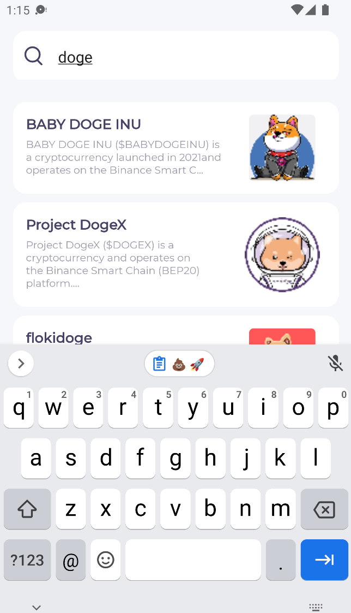
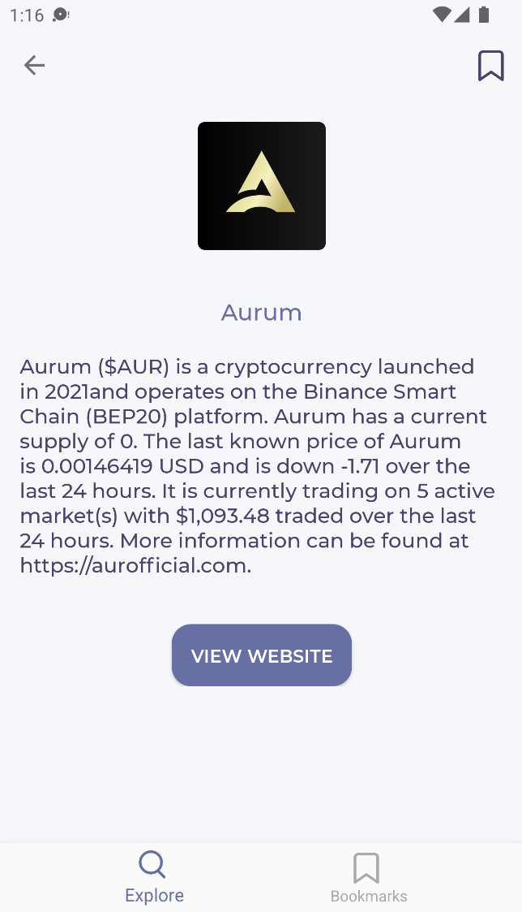

# MoonLand

MoonLand queries social media platforms to provide social sentiment analytics for various crypto coins.

Currently moonland supports only Twitter API as a data source, but can be easily extended to support multiple data sources (Reddit, 4Chan, Facebook,..).

A "SocialPost" is a single (unique) instance of social media content that contains topic of interest (e.g. mention of some cryptocurrency). Moonland maintains it's own index of posts of interests, which is updated within predefined intervals.

Moonland can return simple social analytics based on data stored in it's internal index of posts.

| Discover shitcoins          | Filter by search term         | View coin details              |
|-----------------------------|-------------------------------|--------------------------------|
|  |  |  |

| View bookmark list              | Change user settings           | 
|---------------------------------|--------------------------------|
|  |  |

## 👋 Get started

1. You need to install Docker & docker-compose in order to run this app with Docker. 
See: [Docker installation instructions](https://www.docker.com/get-started)

2. Add environment variables
Create `.env` file in project root, with environment variables defined in `.env.example`

3. Once you have installed and setup docker, run:
    ```shell
   # run development configuration
    docker-compose up -d
   
   # run production configuration
   docker-compose -f docker-compose.yml -f docker-compose.prod.yml up
    ```
   
   Your local app should now be up and running on http://localhost:5000 🥳.

## 🏛 Architecture

Moonland data model is designed with extensibility in mind. We could easily extend the platform to support multiple data sources (aka. "social platforms"), etc.


In terms of application architecture, Moonland is based on a simple microservice architecture, with 2 services:
- `analytics` is concerned with data aggregation and analysis
- `gateway` deals with user management and authentication (also acts as a proxy)

<p align="center">
    
</p>


## ⚙️ Configuration

Most of the system is easily portable across multiple environments. Sensitive and configurable parameters are defined with OS environmental variables. 

Bellow is a complete list of different environmental variables supported. 

> NOTE: Variables that are not explicitly defined as *optional* are required for the system to function.

Data source authentication:
- `COINMARKETCAP_API_KEY`
- `TWITTER_API_KEY`
- `TWITTER_API_SECRET`
- `TWITTER_ACCESS_TOKEN`
- `TWITTER_ACCESS_TOKEN_SECRET`

Analytics service database:
- `DB_HOST`
- `DB_PORT`
- `DB_DATABASE`
- `DB_USER`
- `DB_PASSWORD`

Data aggregation intervals:
- `COIN_FETCH_INTERVAL` (optional) - crypto data aggregation interval in ms (defaults to 1h)
- `SOCIAL_FETCH_INTERVAL` (optional) - social data aggregation interval in ms (defaults to 10min)

## ✌️ Contributors

- Bartolomej Kozorog (63200152)
- Jan Šuklje (63180292)
